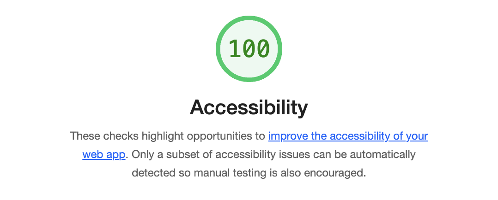

# wirefame-exercise

# LAB - 08a

## Project Name: Wireframe-Exercise

This project utilizes HTML and CSS to create a wireframe template.

### Author: Jennifer

### Links and Resources

* [Mdn](https://developer.mozilla.org/en-US/docs/Web/JavaScript/Reference/Global_Objects/Math/floor)

### Lighthouse Accessibility Report Score

